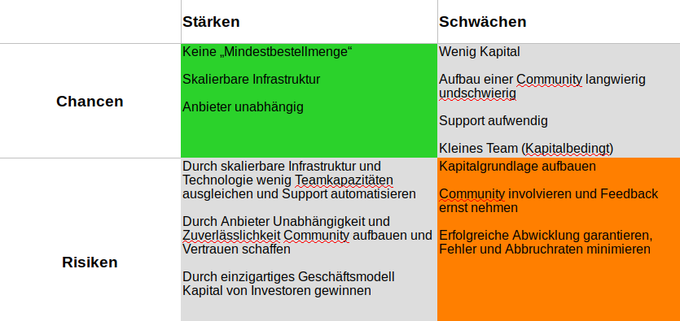

## Crowd Delivery Service

im Rahmen des WP's  
**Softwareentwicklung in und für die Cloud**   

* * *

# Das Projekt

§§

## Motivation

-   **176 Mrd. €** Umsatz im Lebensmitteleinzelhandel in Deutschland (Quelle: [Statista][b71eb2b8])
-   **38,41 Mio.** Deutsche, die Mehrmals pro Woche Lebensmittel einkaufen (Quelle: [Statista][b71eb2b8])
-   Hohe **Liefergebühren** von etablierten Lieferdiensten
-                 [b71eb2b8]&#x3A; <https://de.statista.com/themen/1191/einkauf-und-konsum-von-lebensmitteln/> "Statista"

§§

## Was macht unser System? Mehrwert?

-   Wir bringen Menschen zusammen!
-   Wir ermöglichen es Personen, sich etwas von privat liefern zu lassen
-   Wir ermöglichen es Personen, durch privates Liefern etwas zu verdienen / ihren Einkauf günstiger zu machen

§§

## Wo läuft unser System?

-   IBM Cloud
-   Serverless Computing (Cloud Foundry)
-   Gehosted in Großbritannien / USA

* * *

# Business Model

§§

## Markt und Konkurrenz

-   Rewe Lieferservice
-   Amazon Fresh
-   Deliveroo
-   Lieferheld

§§

## SWOT-Analyse

§§

## Monetarisierung

-   Gebühr für erfolgreiche Abwicklung
-   Prozentualer Anteil vom Gesamtpreis
-   Werbeanzeigen
-   Verkauf von Daten für Marketingzwecke

* * *

# Technische Lösung

§§

## Architektur

* Microservices
  - Data Service (Speichert Matches und Kunden)
  - Match Service (Logik zum generieren von Matches)
  - WebUI (WebUI das Eingaben verarbeitet und versendet)

§§

## Technologien

* Java, Python
* Hibernate, SpringBoot, Thymeleaf, Python Flask
* Docker, Git, Gradle, IBM Toolchain
* H2 Database, Cloudant NoSQL

§§

## Cloud Patterns

* 1 Codebase: Anwendung unterteilt in einzelne Subsysteme - Jedes mit eigenem Repository

§§

* 2 Dependencies: Jeder Microservice isoliert seine Abhängigkeiten

§§

* 3 Config: Multiple config files for different environments

§§

* 4 Backing Services: Parameter in Config Files festgelegt

§§

* 5 Build, release, run: Pipeline für alle Repositories, automatisches Deployment bei Änderung auf Master

§§

* 6 Processes: Statuslose Kommunikation (REST)

§§

* 7 Port Binding: Microservices exportieren HTTP als Service
*
§§

* 8 Scaling: Möglichkeit für Scale Up, Scale Down

§§

* 9 Disposability: Bei Crashes werden Services schnell neu gestartet

§§

* 10 Dev / prod parity: Umgebungen sind identisch

* * *

# Team

§§

## Die Mannschaft

-   Talal Tabia (Angewandte Informatik)
-   Christian Bargmann (Wirtschaftsinformatik)
-   Sabrina Sendel (Technische Informatik)

§§

## Know-How

-   Java, Python, C++, C#, C
-   Hibernate, Spring, Python Flask, SQLAlchemy, Android
-   Docker, Kubernetes
-   Was fehlt: PHP, Javascript, allgemein "Frontend"

§§

## Entwicklungsprozess

-   Aufteilung nach Zuständigkeiten
-   Christian (Backend, Matching-Service, Data-Service)
-   Talal (Backend, Data-Service, WebUI-Service)
-   Sabrina (Security, Dokumentation)

* * *

# Projektplan

§§

## Geplant / Tatsächlich

§§

## Risiken / Probleme

* Parallele Veranstaltungen
  - Praktika
  - Abgaben
  - Zwischenprüfungen
* Kommunikation / Terminplanung im Team

§§

## Erfolge

-   3 funktionsfähige Microservices
-   "Cloud-Native" Entwicklung, Skalierbar
-   Viele wertvolle Erfahrungen über Entwicklung von Microservices, Cloud

* * *

# Ausblick

-   Wir haben viel über unsere Fehler gelernt
-   Wir sind von der Idee überzeugt und können uns vorstellen diese professionell weiterzuverfolgen
-   Neuentwicklung mit Erfahrungen aus dem Praktikum
    -   Dokumentation der Schnittstellen (!!)
    -   Organisiertes Arbeiten
    -   Professionelles Frontend oder App
    -   Architekturänderungen
